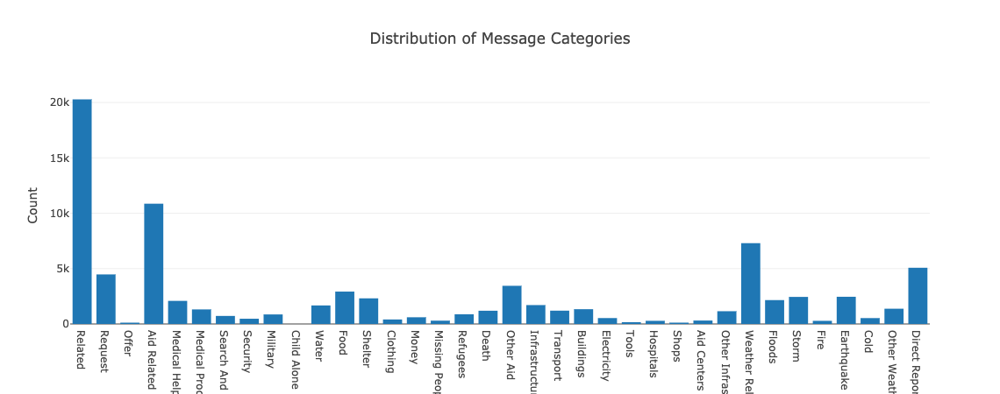

# Disaster Response Messages Classification

In this project, we create a web application that classify disaster messages which
takes some messages of a disaster (or anything) and classify it to one or more
categories. In real world scenario, this may be useful to some disaster management
organizations, e.g. BNPB in Indonesia (Indonesian National Board for Disaster Management).

The application utilizes machine learning model to analyze incoming text message
and then fill green color in one or more disaster categories of all 36 categories.

For more detail about the dataset used in the project, go to section [Dataset](#Dataset).

> For the newer version of dataset see [here](https://appen.com/datasets/combined-disaster-response-data/).

## Getting Started

### Directory Structure

The project follows directory below
```
|- LICENSE													<- LICENSE file
|- data
|  |- disaster_categories.csv				<- categories data
|  |- disaster_messages.csv					<- messages data
|  |- process_data.py								<- ETL script
|
|- apps
|  |- templates
|  |  |- go.html										<- message analysis/classification page
|  |  |- master.html								<- home page
|  |
|  |- __init__.py
|  |- routes.py											<- page routing
|
|- viz															<- statis viz for documentations
|  |- message_categories.png				<- viz of category distribution
|
|- models
|  |- __init__.py										<- functions and classes for modelling
|  |- model.joblib									<- trained and serialized model used in app
|  |- eval.txt											<- model performance for each category
|
|- train.py													<- script to train the model
|- server.py												<- script to run the web app
|- .env.example											<- example of env variables
|- Pipfile													<- pip's requirement file
|- Pipfile.lock											<- dependency reference associated with Pipfile
|- README.md												<- documentation for developers and users
```

### Requirements

This repository uses Python 3.8.

* We use [pyenv](https://github.com/pyenv/pyenv) and [pipenv](https://github.com/pypa/pipenv) to manage the python version and environment.
* Please see `Pipfile` for package and its versions used in this project.


### Preparation

* Clone this repository
```bash
git clone https://github.com/syahrulhamdani/disaster-response-pipeline
```
* We use pipenv to manage the environment. To install all libraries in Pipfile,
run below

```bash
PIPENV_VENV_IN_PROJECT=1 pipenv install --dev
```

* **IMPORTANT**. Make sure to create your `.env` for necessary environment variables.
`.env.example` could be your template, just copy paste it.


## Usage

1. Make sure you have the dataset, `disaster_messages.csv` and `disaster_categories.csv`, inside `data`
directory.

2. Perform ETL steps to process both data by running

```bash
pipenv run python data/process_data.py disaster_messages.csv disaster_categories.csv disaster.db
```

This will process and transform both dataset and load it in a SQL database `disaster.db`.

3. Now that the dataset is ready, build and train the model by running

```bash
pipenv run python train.py disaster.db model.joblib
```

This will save the model in `models/model.joblib`.

4. As all is ready, we can run the web app in our local environment using below command

```bash
pipenv run python server.py
```

## Dataset

* There are about categories with each message can belong to more than 1 category.
Hence, it's multilabel data.
* The dataset is imbalanced which each category has a contrast number of `True` and `False` value.


